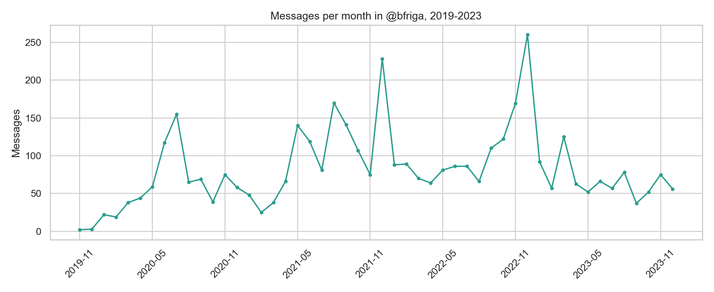
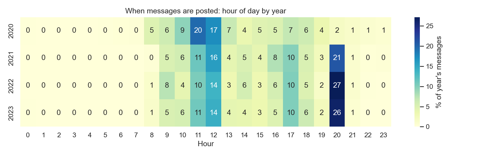
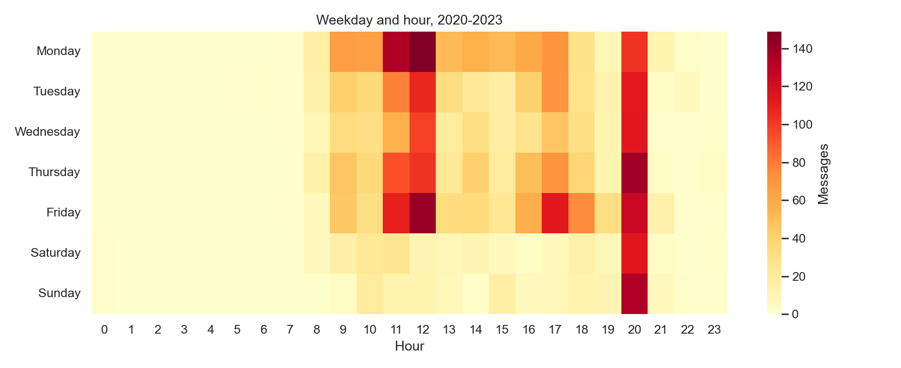
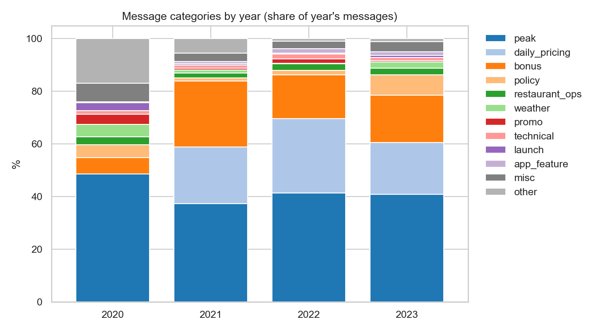
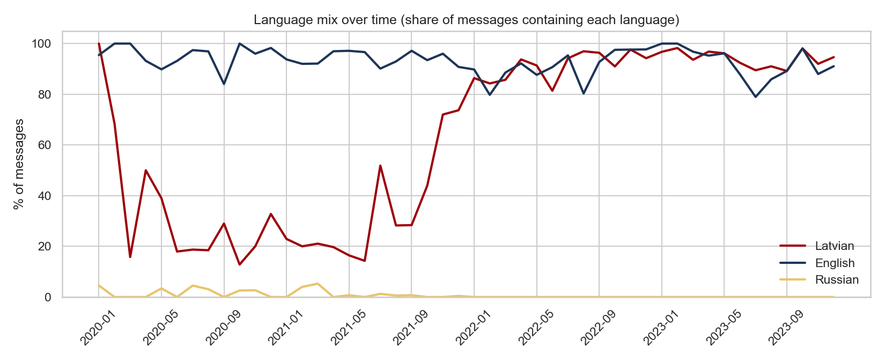
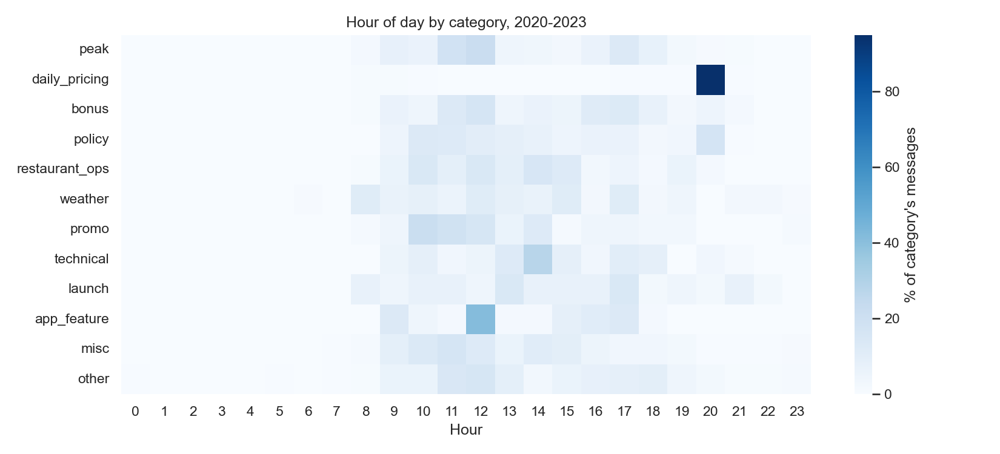
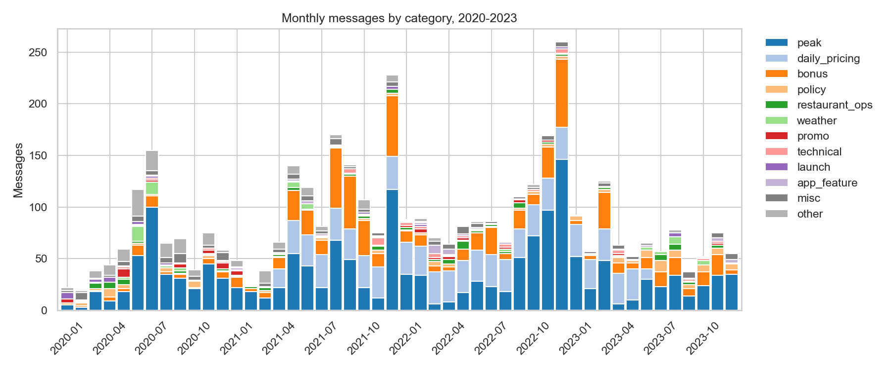
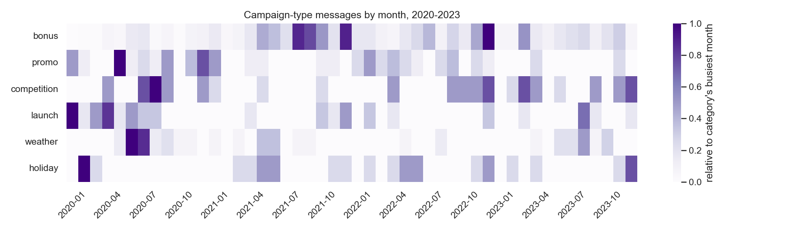

# @bfriga, a look at how Bolt Food talked to its Riga couriers, 2019 to 2023

This is a small data analysis project on the public Telegram channel `@bfriga`, the channel Bolt Food used to message its couriers in Riga. I pulled my own Telegram Desktop export of the channel and looked at what the messages are about, when they go out, and how the language and category mix changed over the five years the service was running in the city.

This is not a delivery volume or earnings project. There are no order counts and no courier data in here, so I can't say anything about how many deliveries happened or how much anyone earned. It is just the text of the announcements and the timing of them.

## Purpose

This project looks at how Bolt Food talked to its Riga couriers between 2019 and 2023. The channel started with launch posts in late 2019, grew through 2020 and 2021, peaked in December 2022, and settled into a smaller, steadier rhythm through 2023. The question is not whether the operation got bigger, message count does not prove that. The question is what the messaging was for, when it went out, and how the language and category mix changed as the service matured.

## Data source

The data is my own Telegram Desktop export of the channel `@bfriga`, saved as `result.json`. It is not from Zenodo or any public dataset. The export runs to 2026 because the channel kept posting after 2023, but I cut it to 2019 to 2023 for a closed historical window.

The export is not in this repo. If you want to reproduce this, export the channel yourself from Telegram Desktop and drop `result.json` in the project folder.

Count funnel:

- 4,783 raw entries
- 4,594 real messages once service messages and empty media posts are dropped
- 4,104 of those between 2019 and 2023, this is the working set

Only 5 messages are from 2019, since the channel starts in November 2019, so year comparisons start at 2020.

## Cleaning and refining

The source file is a Telegram Desktop export of the public channel `@bfriga`, saved as `result.json`. Exporting from Telegram is easy. Working with the export is not, because the format is built for reading, not for analysis. Most of the effort in this project went into turning the raw export into something a pandas dataframe can hold.

**Source and count funnel.** The raw export contains 4,783 entries. The first drop removes 22 `type: service` messages, which are channel creation events, pins, and system notifications, not courier-facing announcements. The second drop removes 167 empty messages, which are media posts (Image or Video) with no caption text. That leaves 4,594 real messages. Filtering to 2019-2023 leaves 4,104, which is the working dataset. The export itself runs to 2026 because the channel kept posting after 2023, but the analysis stops at the end of 2023 for a closed historical window. Every drop is deliberate and documented, because the count funnel is part of the result.

**The `text` field is not a string.** This was the first real surprise. In `result.json` each message has a `text` field, and it is sometimes a plain string, sometimes a list of mixed types. A typical example is:

```python
['Bolt Food Rīgā uzsāks darbību jau nākamnedēļ!...',
 {'type': 'bot_command', 'text': '/delivery'},
 ' + 1.5€ bonus for every delivery. 🔥']
```

Telegram breaks messages into segments whenever formatting, links, or bot commands appear. Loading this column directly into pandas produces a column of mixed types, which breaks every downstream operation. The fix is a flatten function that walks the list, keeps string chunks, extracts the `text` key from any dict, and concatenates the result. Without this step, half the messages are unreadable.

**The bot-command regex ate URLs.** Telegram posts contain embedded commands like `/delivery` that are noise for analysis. The first attempt to strip them used the pattern `/\w+`, which matches any slash followed by word characters. This worked for `/delivery` but also matched path segments inside URLs. `https://topvelo.lv/` became `https:/.lv`, and similar junk appeared throughout the text. The fix was to anchor the pattern so it only matches standalone command tokens at word boundaries, not slashes inside links.

**Language flags are heuristics, not ground truth.** The channel posts in Latvian, English, and Russian, often all three in a single message with flag emoji. To quantify the language mix, three boolean flags were added: `has_lv`, `has_ru`, `has_en`. The first version of `has_en` checked for common English words like "the", "and", "for", "you", "your". This missed short English-only posts such as "Orders are coming in non stop!" because none of those stopwords appear. The flag was refined, but it remains a heuristic. The README states this. The channel is multilingual and no regex will produce perfect language detection on mixed-language messages.

**Substring matching gave false positives in the classifier.** This was the largest single source of bad categories. The keyword classifier initially matched substrings anywhere in the text, which produced:

- "rain" matching inside "training"
- "jāņ" (for Jāņi, Midsummer) matching inside "jāņem" (Latvian for "to take")
- "Maskavas" (a Riga street name) matching as if it were a mask rule

The fix was to use word boundaries and case-sensitive checks where the language allowed it. This is the most common mistake in keyword-based classification. It is also the reason the classifier had to be iterated several times instead of written once.

**Category boundaries needed rework.** Several categories were capturing the wrong messages at first.

- `fare` was full of bonus alerts, because bonus posts often mention rates and earnings. It was tightened to fare-specific language like "base earning", "distance fee", "minimum payment", "pricing model".
- `policy` and `fare` were both capturing the daily pricing template, which is a scheduled recurring post, not a policy announcement or a fare change. The daily pricing template needed to be recognised as its own recurring pattern.
- `peak` kept missing demand wording because the classifier only knew the obvious phrases. Reading raw samples revealed that phrases like "orders are incoming one after another" and "otra" (Latvian for "one after another" in this context, not "other") were common demand signals and needed explicit patterns.

**The `other` bucket was the honest measure of failure.** After the first classifier run, about 40 percent of messages fell into `other`. Through repeated rounds of sampling, refining, and pattern tightening, that dropped to about 5 percent. This is the real story of keyword classification. It is not one pass. It is reading, guessing, checking, and tightening until the messages stop falling through.

**Priority order matters.** Many messages match more than one category. A "rain bonus" hits both `weather` and `bonus`. A "Christmas bonus" hits both `holiday` and `bonus`. The rule that was adopted: the more specific or contextual a category is, the higher it ranks. Weather and holiday come before generic bonus, because they explain *why* the bonus was issued. Each message gets a primary `category` (the first match) and an `all_categories` field with all matches joined by a pipe. This way the analysis can use either view.

**Two cleaning issues remain open and are flagged below.**

1. The 20:00 hour is the single busiest slot in the data, with 839 messages across the whole window. It lines up with the start of the daily pricing pattern in 2021. This suggests the 20:00 posts are the next day's rate sheet, posted the evening before. Chart 4.6 confirms it, 749 of the 789 daily_pricing messages sit at hour 20. So the slot is described as an evening rate announcement, not as an end-of-day broadcast.
2. Telegram Desktop writes timestamps in the local timezone of the machine that did the export. The hour-of-day charts are only in Riga time if the exporting laptop was on Riga time. This is stated as a caveat, and the lunch and dinner peak check is what supports it.

## What came out

### 4.1 messages per month



Not a straight growth line. Climbs through 2020 to a July peak of 155, then May to August 2021 sits at 140 to 170 a month, then two sharp winter spikes, 228 around December 2021 and 259 around December 2022. 2023 calms down to 51 to 76 a month. It looks more like seasons and campaigns than steady growth.

### 4.2 hour of day by year



2020 is mostly midday, 11:00 and 12:00 together are about 37 percent of the year and 20:00 is only 2 percent. From 2021 a 20:00 slot shows up at 21 percent and grows to 27 percent in 2022 and 26 percent in 2023. 11:00 and 12:00 stay at roughly a quarter of posts, 17:00 holds around 10 percent. Almost nothing between 21:00 and 07:00.

### 4.3 weekday by hour



20:00 is hot every single day and it is pretty much the only hot spot on Saturday and Sunday. Weekdays also have a late morning block at 11:00 to 12:00, heaviest on Monday and Friday, and a smaller one at 17:00 that is strongest on Friday. Wednesday is the quietest weekday, weekends are much lighter overall.

### 4.4 category mix by year



Peak is the single biggest category every year, 41 to 49 percent of the year's messages, and it stays that size in 2020 through 2023 even though total volume changes a lot. daily_pricing is zero in 2020, then jumps in 2021 and stays around 20 percent of the year through 2023. Bonus is the one that actually moves, 6 percent in 2020, jumps to 25 percent in 2021, then slides to 17 percent in 2022 and 18 percent in 2023. Other shrinks every year as the classifier gets tuned, 17 percent in 2020 down to 1 percent in 2023. Policy is small until 2023, when it jumps to 8 percent. So the mix is basically stable, what changes is volume and the bonus and daily_pricing blocks coming and going.

### 4.5 language mix over time



English is near 100 percent the whole way through because Bolt posts everything in English as well as the local language, so that line is basically flat and not very useful on its own. Latvian sits around 50 to 65 percent and holds up across the whole window. Russian is basically invisible, a few percent at most and mostly early. So the channel runs on English plus Latvian, not English plus Russian. Months under 10 messages are dropped so the lines do not jump around on tiny samples.

### 4.6 hour of day by category



daily_pricing has one hot cell, hour 20. 749 of its 789 messages sit there, which matches the 20:00 slot starting in 2021 when daily_pricing starts. So 20:00 is the next day's rate sheet. peak sits in the 11:00 to 12:00 and 17:00 blocks, almost nothing at 20:00. bonus leans late morning and afternoon. Two shapes in the channel, a daytime push for demand and a fixed 20:00 rate sheet.

### 4.7 monthly volume by category



4.1 with categories broken out. daily_pricing is the flat floor from 2021 on, it does not spike. The two December spikes are bonus and peak together. Mid 2021 is bonus heavy. 2023 is thin on top, peak holds but bonus and promo drop. Weather shows up in the winter months.

### 4.8 campaign cycles



Each row is scaled to its own busiest month, so rows are not comparable in size. bonus and promo run together, peak late 2021 and early 2022, then fade through 2023. launch is front loaded, almost all 2019 and 2020. competition is spread out, 2020 and 2022. weather clusters in winter. holiday is tiny and scattered. bonus and promo are the campaign engine and they taper off after 2022, which is why volume settles in 2023.

## Headline numbers

- 4,104 messages in the 2019 to 2023 window
- 78.0 percent of messages are templated posts, peak plus daily_pricing plus bonus
- 5.3 percent unclassified, down from about 40 percent after tuning
- busiest hour is 20:00 with 839 messages across the window, and it is the daily rate sheet
- busiest weekday is Monday
- language mix is English plus Latvian, Russian is under 1 percent
- 95 percent of daily_pricing posts go out at 20:00

## Sanity checks

- messages with no language flag: 75, or 1.8 percent
- lunch peak posts land at 11:00 and 12:00, 144 of 162, or 89 percent
- dinner peak posts land at 16:00 and 17:00, 103 of 136, or 76 percent

The lunch and dinner checks are consistent with the timestamps being Riga time, since those are where Riga meal peaks sit.

## Limitations

- the classifier is keyword and regex based, so it misses unusual wording and can hit a keyword used in a different sense
- categories under about 1 percent get lumped into misc in the charts, the CSV keeps the real labels
- messages are multi-topic and trilingual, so first-match is a simplification, `all_categories` has the full list
- this is a one-way broadcast channel, so it shows when Bolt posted, not what couriers did
- 2019 has only 5 messages so it is left out of year comparisons
- there are no delivery volumes, order counts or earnings anywhere in this data, message count is not a proxy for operation size
- timestamps are assumed to be Riga time. Telegram Desktop writes timestamps in the timezone of the machine that did the export, so if that laptop was not on Riga time the hour charts shift by the offset. The lunch and dinner checks are consistent with Riga time, but that is supporting evidence, not proof

## Repo

GitHub repo: https://github.com/adipaaadi/bolt-food-riga-analysis

Data source: my own Telegram Desktop export of `@bfriga`, not included in the repo. To reproduce, export the channel yourself and save it as `result.json` in the project folder.

Files in the repo:

- `bfriga_analysis.ipynb`, the notebook with the full pipeline and all 8 charts
- `bfriga_classified.csv`, the final cleaned and classified data
- `bfriga_clean.csv`, intermediate output after text cleaning
- `bfriga_2019_2023.csv`, intermediate output, the working window before classification
- `load.py`, the loader and cleaning script
- `classify.py`, the classifier script
- `charts/`, the 8 PNGs
- `README.md`, this file

Note that `load.py` and `classify.py` are the standalone versions of what is also in the notebook, kept here so the pipeline is readable without opening the notebook.
````
